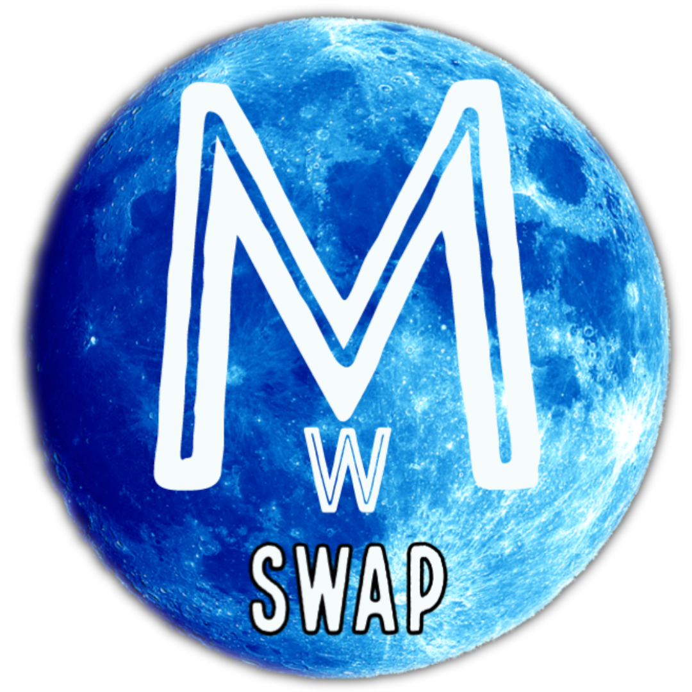

# MoonWalkerSwap Exchanges

&#x20;               &#x20;

## How to Add/Remove Liquidity

"Liquidity" is central to how MoonwalkerSwap's Exchange works. You can add liquidity for any token pair by staking both through the Liquidity page.

In return for adding liquidity, you'll receive trading fees for that pair, and receive LP Tokens you can [stake in Farms](https://docs.moonwalker.network/products/yield-farming/farms) to earn DUST rewards!

#### **Adding liquidity**

To provide liquidity, you’ll need to commit an amount of any token pair you like. Your lowest value (in USD) of the two tokens will be the limit to the liquidity you can provide.

You can easily trade for any tokens you need. Visit our [How to Trade on MoonwalkerSwap](https://docs.moonwalker.network/get-started/trade-guide) guide if you need to.

In this example, we will add liquidity using BNB and DUST.

1. Visit the [Liquidity page](https://home.moonwalker.network/#/pool).
2. Click the **Add Liquidity** button.
3. For the top Input, leave BNB as it is.
4. For the bottom input, click ‘Select a currency’ and pick DUST.
5. Enter an amount on one of the tokens under “Input”. The other will calculate automatically.

(If your balance is too low on one pair enter a lower amount.)

1. Click the **Approve DUST** button. Your wallet will ask you to confirm the action.
2. The **Supply** button will light up. Click it.
3. A window will appear saying how much you will receive. Click the **Confirm Supply** button. Your wallet will ask you to confirm the action.
4. After a short wait you will see your LP Token balance at the bottom of the page.

You can repeat the steps above to add more liquidity at any time.

#### **Removing liquidity**

To remove liquidity.

1. Visit the [Liquidity page](https://swap.moonwalker.network/#/pool)**.**
2. Click on your pair under “Your Liquidity”.
3. Click **Remove**. A new window will appear.
4. Use the buttons or slider to choose what percent to remove. Choose **MAX** to remove everything.
5. Click **Approve**. Your wallet will ask you to confirm the action**.**
6. The **Remove** button will light up. Click it.
7. A window will appear saying what you will receive. Click **Confirm**. Your wallet will ask you to confirm the action.
8. After a short wait you will see your new LP Token balance at the bottom of the page. &#x20;

## Liquidity Pools

When you add your token to a Liquidity Pool you will receive Liquidity Provider (LP) tokens and share in the fees.

### LP Tokens

As an example, if you deposited **DUST** and **BNB** into a Liquidity Pool, you'd receive **DUST-BNB LP** tokens.

The number of LP tokens you receive represents your portion of the DUST-BNB Liquidity Pool.

You can also redeem your funds at any time by removing your liquidity.

### Liquidity Providers earn trading fees

Providing liquidity gives you a reward in the form of trading fees when people use your liquidity pool.

Whenever someone trades on MoonwalkerSwap, the trader pays a 0.25% fee, **of which 0.17%** is added to the Liquidity Pool of the swap pair they traded on.

For example:

* There are 10 LP tokens representing 10 DUST and 10 BNB tokens.
* 1 LP token = 1 DUST + 1 BNB
* Someone trades 10 DUST for 10 BNB.
* Someone else trades 10 BNB for 10 DUST.
* The DUST/BNB liquidity pool now has 10.017 DUST and 10.017 BNB.
* Each LP token is now worth 1.00017 DUST + 1.00017 BNB.

To make being a liquidity provider even more worth your while, you can also put your LP tokens to work whipping up some fresh yield on the [DUST Farms](https://home.moonwalker.network/farms), while still earning your 0.17% trading fee reward.

### Impermanent Loss

Providing liquidity is not without risk, as you may be exposed to impermanent loss.

[“Simply put, impermanent loss is the difference between holding tokens in an AMM and holding them in your wallet.” - Nate Hindman](https://blog.bancor.network/beginners-guide-to-getting-rekt-by-impermanent-loss-7c9510cb2f22)

## 🔄 Exchange

MoonwalkerSwap is an Automated Market Maker (AMM), and the Exchange is at the heart of MoonwalkerSwap. MoonwalkerSwap is the leading AMM on the Binance Smart Chain, and as statistics tell, the most popular Decentralized Exchange (DEX) ever!

The MoonwalkerSwap Exchange offers several features that support decentralized trading:

#### Swapping/Trading

MoonwalkerSwap lets users trade without the need to go through a Centralized Exchange. Everything you do on MoonwalkerSwap is routed directly through your own wallet—no need to trust someone else with your coins!

#### Liquidity Pools

You can only swap tokens on MoonwalkerSwap if there is enough liquidity for those tokens. If nobody has added much liquidity for the token or tokens you want to swap, it will be difficult, expensive, or impossible to do so.

Providing liquidity will get you LP Tokens, which will earn you rewards in the form of trading fees for making sure there's always liquidity for the exchange to use.

#### Yield Farming

Yield farming lets users that are providing liquidity earn DUST rewards by locking their LP tokens into a smart contract. The incentive is to balance out the risk of [impermanent loss](https://academy.binance.com/en/articles/impermanent-loss-explained) that comes along with locking in your liquidity.

#### Initial Farm Offerings (IFOs)

An Initial Farm Offering is an event that lets users buy into a limited-time offer to purchase new tokens. The IFO price is usually very generous.

## How to Trade

Trading on MoonwalkerSwap is very easy compared to most exchanges. You aren't going to be overwhelmed by charts or jargon, and calculations are all handled for you.

#### Getting set up to trade

Before you can trade, you will need a Binance Smart Chain-compatible wallet. You can learn how to get one [here](https://docs.pancakeswap.finance/get-started/wallet-guide). You will also need to have some BEP20 tokens to trade with. You can learn how to get some [here](https://docs.pancakeswap.finance/get-started/bep20-guide).

#### Trading on the MoonwalkerSwap exchange

1. Go to the exchange page [here](https://swap.moonwalker.network/#/swap).
2. Unlock your Binance Smart Chain-compatible wallet by clicking **Unlock Wallet** (you can also **Connect** in the top right-hand corner). If you haven't yet connected your wallet to MoonwalkerSwap, you can view the guide to [here](https://docs.moonwalker.network/get-started/connection-guide).
3. Choose the token you want to trade from the dropdown menu in the "From" section. The default setting is BNB.

Whichever token you choose, you will need to make sure you have some to trade with. Your balance is shown above the token dropdown menu.

1. Choose the token you want to trade to in the "To" section as above. Next, type an amount for your "To" currency by clicking inside the input box.

Your "From" currency amount will be estimated automatically. You can also type your "From" amount and have the "To" amount estimate automatically if you like.

1. Check the details, and click the **Swap** button.
2. A window with more details will appear. Check the details are correct.

When you are ready, click the **Confirm Swap** button. Your wallet will ask you to confirm the action.

1. Done! You can click **View on BscScan** to see your transaction details on the explorer.

## Token Swaps

\*\*\*\*[**Token swaps**](https://swap.moonwalker.network/#/swap) on MoonwalkerSwap are a simple way to trade one BEP-20 token for another via automated liquidity pools.

When you make a token swap (trade) on the exchange you will pay a **0.25% trading fee**, which is broken down as follows:

**0.17%** - Returned to Liquidity Pools in the form of a fee reward for liquidity providers.

**0.03%** - Sent to the MoonwalkerSwap Treasury.

**0.05%** - Sent towards DUST buyback and burn.
